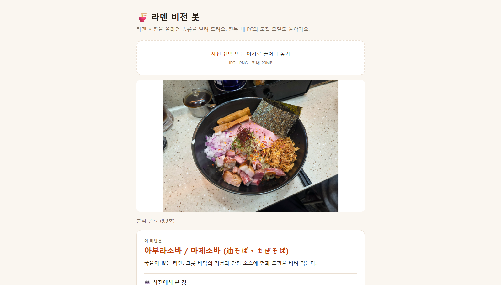
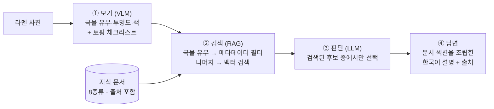

# 🍜 Ramen Vision Bot

**라멘 사진을 보고 종류를 판별하고, 출처가 달린 설명을 보여주는 로컬 Vision + RAG 봇**

유료 API 없이 **내 PC(RTX 3060 Ti, VRAM 8GB)에서만** 돌아갑니다. 작은 7B 비전 모델이 지어내는 답(할루시네이션)을 **"보기"와 "판단"을 분리한 RAG 파이프라인**으로 줄였습니다.

| 튜닝에 쓰지 않은 사진 25장 기준 | 정답률 |
|---|---|
| VLM 단독 (qwen2.5vl:7b에게 바로 종류를 물음) | 28% |
| **이 프로젝트 (특징 추출 → 하이브리드 검색 → 판단)** | **60%** |

> 판별 대상: 시오 · 쇼유 · 미소 · 돈코츠 · 이에케 · 토리파이탄 · 카라이(매운 라멘) · 아부라소바 (8종류)



---

## 문제: 작은 로컬 VLM은 그럴듯하게 틀린다

처음에는 VLM에게 사진을 주고 바로 "무슨 라멘이야?"라고 물었습니다.

| 입력 | 모델 답변 | 실제 |
|---|---|---|
| "이에케 라멘이 뭐야?" (한국어) | "한국의 전통 라멘 요리" | 요코하마 발상의 돈코츠 쇼유 라멘 |
| "家系ラーメンとは?" (일본어) | "…細めの麺(가는 면)을 사용" | 굵은 면이 특징 |
| 국물 없는 아부라소바 사진 | "국물이 흰색이라 이에케" | **국물이 없음** |

- 23장 중 **4장(17%)** 만 맞힘 — 9종류 무작위 찍기(11%)와 비슷한 수준
- 모르면 한 답("이에케")으로 쏠리고, 답과 근거가 서로 모순
- 한국어 자유 서술에서는 "파인애플, 파인애플, 파인애플…" 같은 반복 루프에 빠짐

## 해결: "보기"와 "판단"을 나눈다

작은 모델에게는 **눈으로 확인할 수 있는 것만** 묻고, 라멘 종류 판단은 **출처가 있는 지식 문서**에 맡겼습니다.



| 단계 | 하는 일 | 핵심 설계 |
|---|---|---|
| ① 보기 | VLM이 사진에서 특징만 추출 | 영어 **선택형(enum)** 질문 + 토핑은 **예/아니오 체크리스트** (나열시키면 없는 재료를 지어냄) |
| ② 검색 | 특징을 한국어 검색어로 바꿔 지식 문서 검색 | **하이브리드 검색**: 확실한 특징(국물 유무)은 필터, 나머지는 bge-m3 벡터 검색 |
| ③ 판단 | 특징 + 후보 문서로 종류 선택 | 답을 **검색된 후보 enum으로 제한**, 출처는 LLM이 아니라 **코드가 붙임** |
| ④ 답변 | 결과를 한국어로 설명 | LLM이 문장을 새로 쓰지 않고 **지식 문서 섹션을 조립** → 모든 문장에 출처 |

## 결과

### 개선 과정 (튜닝용 사진)

| 버전 | 바꾼 점 | 정답률 | 검색 재현율* |
|---|---|---|---|
| Before | VLM에게 바로 종류를 물음 | 17% (4/23) | — |
| 특징 추출만 | 종류는 묻지 않고 보이는 것만 선택형으로 | 국물 유무 **100%**, 국물 색 78% | — |
| RAG v1 | 전체 문서에서 검색 | 22% (5/23) | 74% |
| RAG v2 | "사진으로 구분하는 법" 섹션만 검색, 후보 중 선택 | 52% (12/23) | 61% |
| RAG v3 | 하이브리드 검색, 비교 문장 분리 | 57% (13/23) | 91% |
| 범위 조정 | 비주류인 쇼유파이탄 제외 (8종류) | 76% (16/21) | 90% |

\* 정답 종류의 문서가 검색 결과(후보)에 포함된 비율. 여기서 빠지면 판단 단계가 맞힐 방법이 없습니다.

### 최종 검증 (튜닝에 쓰지 않은 사진)

위 수치는 같은 사진을 보며 개선했기 때문에 **부풀려져 있을 수 있습니다.** 그래서 위키미디어 공용의 CC 라이선스 사진 25장으로 **코드 수정 없이** 다시 쟀습니다.

| | 정답률 |
|---|---|
| VLM 단독 | 28% (7/25) |
| **RAG 파이프라인** | **60% (15/25)** |

튜닝용 사진(76%)보다 16%p 낮지만, 새 사진에서도 VLM 단독 대비 **2배 이상**입니다.

모든 실험의 설정·결과·실패 분석은 [docs/experiments.md](docs/experiments.md), 원본 결과는 [`results/`](results/)에 있습니다. 기술별 설계 이유는 [docs/tech-notes.md](docs/tech-notes.md)에 정리했습니다.

## 설계하며 배운 것

1. **작업을 쪼개면 같은 모델도 달라진다** — 모델을 바꾸지 않고 질문 방식만 "종류 맞히기 + 자유 서술"에서 "보이는 것 고르기"로 바꿨더니, 국물 없는 라멘 인식이 1/3 → 3/3이 되고 JSON 깨짐·반복 루프가 사라졌습니다.
2. **임베딩은 부정("~없음")에 약하다** — "국물 없음" 검색어가 국물 있는 라멘 문서와 더 가깝게 나왔습니다. 확실한 정보는 벡터 유사도 대신 **메타데이터 필터**로 처리했습니다.
3. **문서 구조가 검색 품질을 좌우한다** — 모든 문서에 있는 "국물" 섹션이 검색 상위를 독차지했고, 다른 종류와 비교하는 문장이 많은 문서는 어떤 검색어에도 걸리는 "허브"가 됐습니다. 검색 대상 섹션을 좁히고 비교 문장을 분리해 재현율을 61% → 91%로 올렸습니다.
4. **LLM에게 시킬 일과 코드가 할 일을 구분한다** — 출처 URL과 한국어 설명문은 LLM이 지어낼 수 있어서 코드가 문서에서 가져오게 했습니다. LLM은 "후보 중 하나 고르기"에만 씁니다.
5. **데이터 누수와 과적합을 경계한다** — 테스트 사진을 보고 쓴 메모는 검색에서 제외했고, 최종 성능은 튜닝에 쓰지 않은 사진으로만 보고합니다.

## 기술 스택

| 분야 | 사용 기술 |
|---|---|
| 로컬 모델 서빙 | [Ollama](https://ollama.com) |
| Vision / 판단 | `qwen2.5vl:7b` (4bit, 6GB) — 8GB VRAM에 7B 두 개는 못 올려서 판단도 같은 모델을 텍스트 모드로 사용 |
| 임베딩 | `bge-m3` (한국어·일본어·영어 다국어) |
| 벡터 DB | Chroma |
| 출력 형식 강제 | Ollama Structured Output (JSON Schema, enum) |
| 웹 데모 | FastAPI + 순수 HTML/JS |
| 언어 | Python 3.14 |

## 실행 방법

**준비물**: Windows / Python 3.11+ / [Ollama](https://ollama.com) / NVIDIA GPU (VRAM 8GB 권장)

```powershell
# 1. 모델 받기
ollama pull qwen2.5vl:7b
ollama pull bge-m3

# 2. 가상환경 + 패키지 설치
python -m venv venv
.\venv\Scripts\Activate.ps1
pip install -r requirements.txt

# 3. 지식 문서를 벡터 DB에 저장 (문서를 고칠 때마다 다시 실행)
python scripts/build_index.py

# 4. 데모 실행 → 브라우저에서 http://localhost:8000
uvicorn ramen_bot.api:app --port 8000
```

평가 스크립트 (사진은 `shio_1.jpg`처럼 `종류_번호.jpg` 이름으로 폴더에 넣으면 파일 이름이 정답이 됩니다):

```powershell
python scripts/eval_rag.py --samples samples_test       # 파이프라인 정답률 + 검색 재현율
python scripts/eval_baseline.py --samples samples_test  # 비교용: VLM 단독
python scripts/eval_features.py                         # 특징 추출 정확도 (data/labels.csv 기준)
```

## 프로젝트 구조

```
ramen_bot/          핵심 로직
  vision.py         ① 보기: 사진 → 특징 + 토핑 체크리스트
  knowledge.py      ② 검색: 문서 청킹, bge-m3 임베딩, Chroma 저장·검색
  judge.py          ③ 판단: 하이브리드 검색 + 후보 중 선택
  answer.py         ④ 답변: 지식 문서 섹션으로 한국어 설명 조립
  api.py            FastAPI 데모 서버
knowledge/          라멘 종류별 지식 문서 (출처 URL 포함)
web/index.html      데모 화면
scripts/            인덱스 생성, 평가 스크립트
data/               정답 라벨, 테스트 사진 출처·라이선스 목록
results/            실험 결과 JSON
docs/experiments.md 실험 기록 (Before/After, 실패 분석)
```

## 한계와 다음 단계

- **데이터가 작습니다.** 종류별 1~7장이라 종류별 정답률은 통계적으로 약합니다.
- **알려진 약점**: 노란빛이 도는 탁한 국물(실제 토리파이탄 등)을 시오로 판단 / 김만 보고 이에케로 판단 / 파가 수북하면 국물 유무를 틀림
- **다음 단계**: 위 약점 개선(튜닝용 사진 기준) → 일본어 메뉴·식권기 읽기 → 소형 모델 QLoRA 파인튜닝 비교

## 관련 프로젝트

```
RamenLog (라멘 방문 인증 서비스) ──▶ AI Research Agent (근거 인용 에이전트) ──▶ Ramen Vision Bot (이 저장소)
```

| 프로젝트 | 한 줄 소개 | 이 프로젝트와의 연결 |
|---|---|---|
| [AI Research Agent](https://github.com/Mal-Mi-Jal/Ai-research-agent) | 주제를 넣으면 웹을 조사해 **원문 근거를 인용한 리포트**를 만드는 LangGraph 에이전트 (MCP·n8n·Docker 배포) | "근거는 검색으로, 출처 목록은 코드로" 설계 원칙과 Chroma·FastAPI 패턴을 이어받음 |
| [RamenLog](https://github.com/Mal-Mi-Jal/Ramen-frontend) | **GPS + 체류 시간으로 방문을 인증**해야 리뷰를 쓸 수 있는 라멘 리뷰 서비스 (Kotlin · Spring Boot, 백엔드 저장소는 비공개) | 다음 단계로 계획한 **영수증 OCR 방문 인증**에 이 프로젝트의 비전 모델을 연결할 수 있음 |

## 데이터와 라이선스

- **지식 문서** (`knowledge/`): 위키백과 일본어판 등의 내용을 요약·재구성했으며, 문서마다 출처 URL이 있습니다.
- **테스트 사진**: 위키미디어 공용의 CC0 / CC BY / CC BY-SA 사진입니다. 사진 파일은 저장소에 포함하지 않고, 사진별 **저작자·라이선스·원본 링크**를 [data/test_sources.csv](data/test_sources.csv)에 기록했습니다.
- **개인 사진**: 직접 찍은 사진은 위치정보(EXIF GPS)가 포함돼 있어 저장소에 올리지 않습니다.
